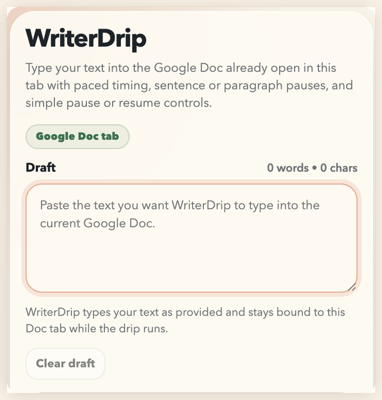
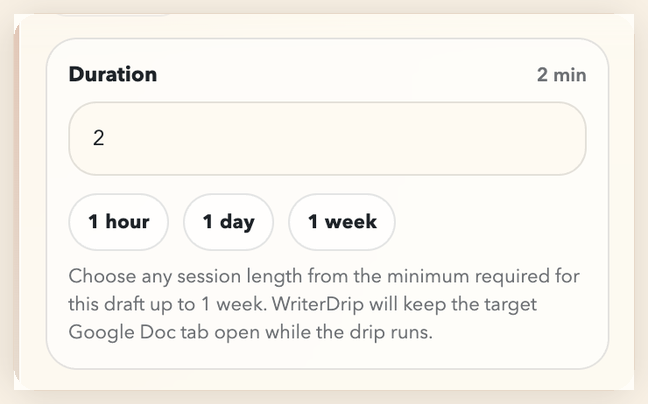
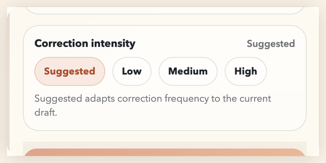

# WriterDrip

WriterDrip is a free and open-source Chrome extension for paced typing in Google Docs. If you are looking for a free Dripwriter alternative, WriterDrip is an independent open-source option that types user-provided text into the Google Doc already open in your browser over a chosen timeline, with pause or resume controls, flexible session lengths, and draft-aware correction intensity.

Local-first, always free, and built for the Google Doc already open in your browser.

  

## Get Started

1. Download or clone this repository.
2. Open `chrome://extensions`, enable `Developer mode`, and click `Load unpacked`.
3. Select the WriterDrip folder that contains `manifest.json`.
4. Open a Google Doc, click inside the document body, open WriterDrip, paste your draft, choose a duration, and click `Start drip`.

### First Run Notes

- WriterDrip only works on editable Google Docs pages.
- Leave correction intensity on `Suggested` if you want the default behavior.
- You can switch to other tabs while the original Google Doc tab keeps running.
- Reload the extension from `chrome://extensions` after pulling updates from GitHub.

## Feature Tour

<table>
  <tr>
    <td align="center" width="50%">
      
       
      <strong>Choose the timeline</strong>
       
      Pick a custom duration, use the quick presets, and let WriterDrip scale from the draft minimum up to longer sessions.
    </td>
    <td align="center" width="50%">
      
       
      <strong>Tune correction intensity</strong>
       
      Leave it on <code>Suggested</code> for draft-aware behavior or switch to a lighter or stronger correction profile yourself.
    </td>
  </tr>
</table>

## What You Get

- Works on a Google Doc you already opened and selected in your browser
- Lets you choose a custom duration from the draft-sized minimum up to 1 week, or use built-in 1 hour, 1 day, and 1 week presets
- Adds layered pacing with burst pauses, sentence or paragraph rests, and context-aware self-correction
- Includes `Suggested`, `Low`, `Medium`, and `High` correction intensity modes, with `Suggested` adapting to the current draft automatically
- Supports pause, resume, and stop controls
- Binds each drip to the specific Google Doc tab where it started
- Keeps active session state outside the popup so closing the popup does not immediately stop the run

## Current Limits

- No Google account connection or Google Drive / Docs API integration
- No remote server runs or cloud processing
- No typing after the target browser or computer shuts down
- No control over how Google Docs groups version history entries
- Strongest with the Google Doc the user already opened in the browser
- Google Docs can change editor behavior without warning
- If the target tab moves away from the original document or loses the editor surface, WriterDrip stops and asks for attention

## Troubleshooting

### Start button is disabled

- Make sure you are on `docs.google.com` and the page is a real editable document.
- Click inside the document body, then reopen the popup.

### WriterDrip cannot attach to the editor

- Wait for Google Docs to finish loading, then click once inside the document body again.
- If needed, refresh the Google Doc tab and reopen the popup.

### Google Docs changes text during a run

- In Google Docs, open `Tools > Preferences`.
- Turn off Smart Compose, spelling or grammar suggestions, and substitutions that keep rewriting text.

## Privacy

- WriterDrip does not send text to any server.
- WriterDrip stores drafts, durations, and active session state locally with `chrome.storage.local`.
- The extension only operates on the current page after the user invokes it.
- This repository is an independent open-source project and is not affiliated with other typing products or services.

For the full policy text, see `PRIVACY.md`.

## Google Docs Version History Notes

WriterDrip types into the live Google Docs editor, but Google controls how version history is displayed and grouped.

- Google Docs lets editors open version history from `File > Version history > See version history` or from the `Last edit` indicator.
- Google may group nearby edits together, and its help docs note that revisions can occasionally be merged to save storage space.
- Google Docs also supports named versions, but those are created from the Google Docs UI by the user, not by WriterDrip.
- WriterDrip does not create, rename, restore, or copy versions on your behalf.
- Because version boundaries are owned by Google Docs, visible history entries may not line up one-to-one with every typing burst.

## For Contributors

- `manifest.json`: extension manifest and permissions
- `shared.js`: shared draft sanitizing, duration, and correction heuristics used by the popup, background worker, and runner
- `popup.html`: popup UI
- `popup.js`: popup behavior and per-tab draft persistence
- `background.js`: run management, recovery, and session state
- `content.js`: Google Docs/editor targeting, timing model, and simulated input
- `docs/assets`: shared screenshots for the landing page, README, and social preview
- `scripts/validate.mjs`: repo-native validation harness for runtime smoke checks and planner replay tests
- `PRIVACY.md`: privacy disclosures for users

Run `npm run validate` before pushing meaningful changes. The validation suite checks:

- manifest and popup wiring
- shared popup/background/content runtime loading
- planner replay so the final output still resolves back to the original draft
- TitleCase guards on larger word-level correction paths

## Community

Issues and pull requests are welcome. See `CONTRIBUTING.md` for the lightweight contribution guide, and avoid posting private document contents in public reports.

## License

This project is licensed under the MIT License. See `LICENSE`.
